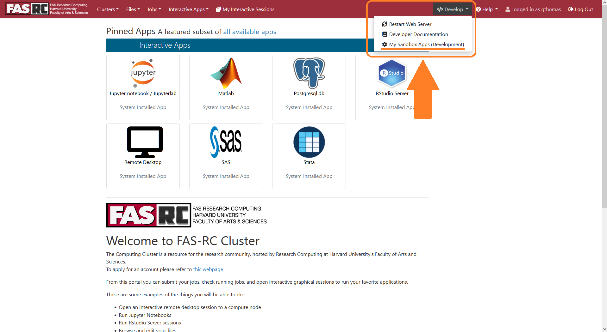
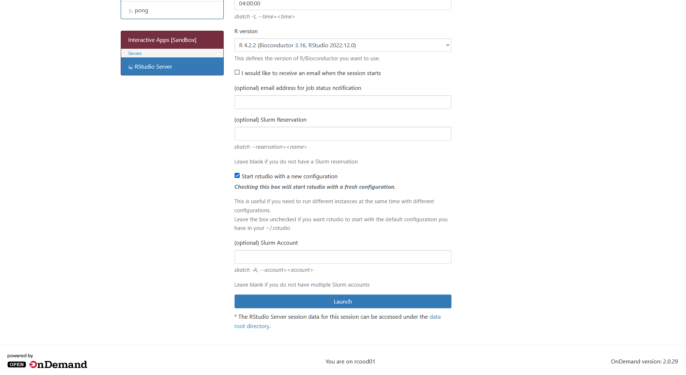
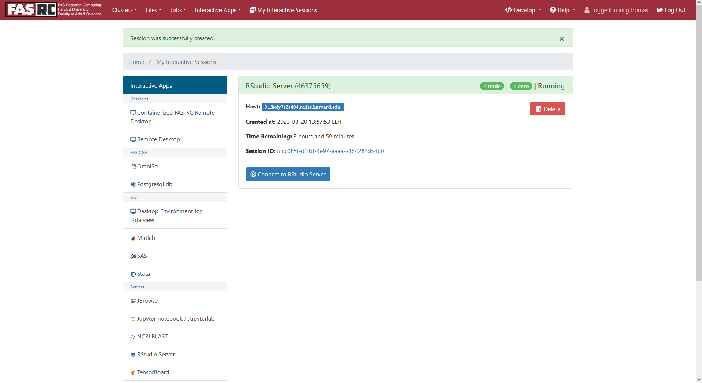
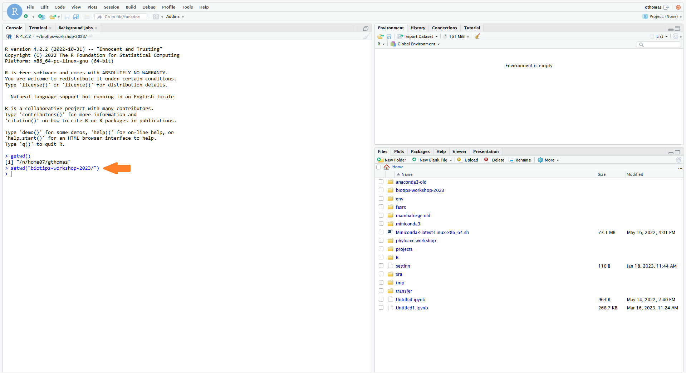
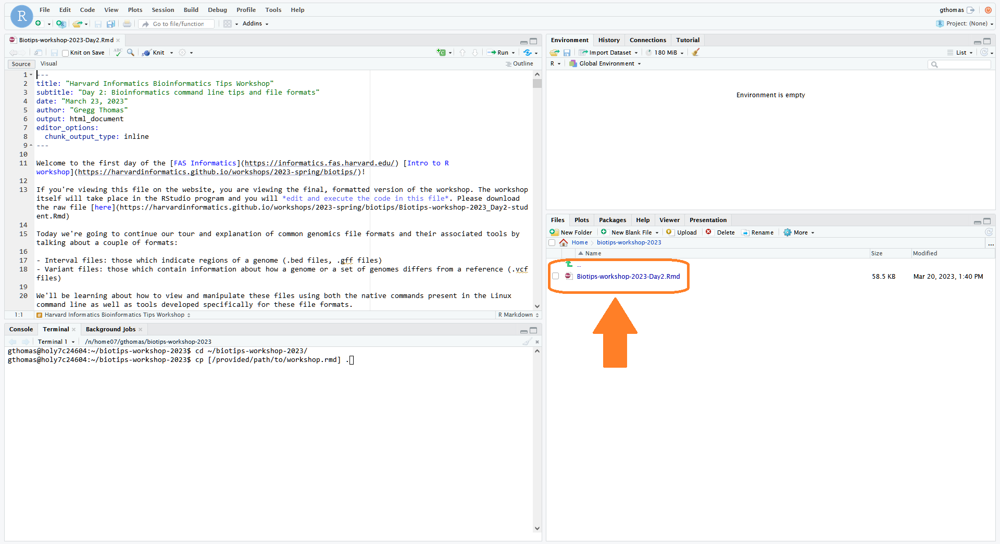

<style>
    table thead { display: none; }
    .md-typeset table, 
    .md-typeset th, 
    .md-typeset td {
        border: none !important;
    }
    /* Remove borders from table, th, and td */

    .md-typeset__table tr:nth-child(even):hover,
    .md-typeset__table tbody tr:nth-child(even):hover {
        background-color: #f6f8fa !important;
    }
    .md-typeset__table tr:nth-child(odd):hover,
    .md-typeset__table tbody tr:nth-child(odd):hover {
        background-color: #ffffff !important;
    }
    /* Disable hover effect on table rows */

    .md-button {
        text-align: center !important;
        justify-content: center !important;
        align-items: center !important;
        display: inline-flex !important;
    }
    /* Center the text in the button */
    
</style>

These are instructions for those who have or can request a FASRC account and have access to the Cannon cluster! If you cannot have a FASRC account, we have tried to provided a way for you to follow along in the workshop, but you will have to follow a [different set of setup instructions](setup-local.md).

!!! warning "Confirm you can login to the cluster before class!"

    Whether you already have a FAS RC account or are requesting one for the first time, you must confirm that you can login to the cluster with your FAS RC account before class by replying to the e-mail you received with info about the workshop. 

## Before Class

### 1. FASRC Account

You will need a FASRC account to be able to login to the VPN and the cluster to follow along in the workshop. If you do not have one, please use the link below to request one. 

[How to: Request FASRC account :octicons-link-external-24:](https://docs.rc.fas.harvard.edu/kb/how-do-i-get-a-research-computing-account/){:target="_blank" .md-button .md-button--primary .centered }

If you already have an account, please confirm you can login before class. 

### 2. VPN Access

In this workshop, we will be connecting to the cluster through a virtual desktop in order to view the workshop notebook in RStudio. In order to connect to the cluster in this way, you must set-up a connection with the FASRC VPN (Virtual Private Network). See the link below for instructions on how to do so. 

[How to: Setup FASRC VPN :octicons-link-external-24:](https://docs.rc.fas.harvard.edu/kb/vpn-setup/){:target="_blank" .md-button .md-button--primary .centered }

### 3. RStudio theough the Virtual Desktop

In this workshop, we'll be opening files that contain example code blocks and exercises in the RStudio program while connected to the Virtual Desktop (VDI). Read the link below for more information about the VDI: 

[How to: VDI :octicons-link-external-24:](https://docs.rc.fas.harvard.edu/kb/virtual-desktop/){:target="_blank" .md-button .md-button--primary .centered }

Feel free to try this before class, but we will be able to help you connect during class. 

--- 

## Day 1 setup

There are several steps to get set up for the workshop. Please follow these instructions carefully and complete them **on the first day of class only.**

!!! warning "VPN and VDI have slightly different usernames for login"

    When logging in to the VPN you will login with your FAS RC account name AND the fasrc domain:
    > username@fasrc

    When logging in to the VDI you will login with just your FAS RC account name:
    > username

1. Connect to the VPN as described in the [link above :octicons-link-external-24:](https://docs.rc.fas.harvard.edu/kb/vpn-setup/){:target="_blank"}, using username@fasrc. 

2. Log-in to the VDI as described in the [link above :octicons-link-external-24:](https://docs.rc.fas.harvard.edu/kb/virtual-desktop/){:target="_blank"}, using username. You should see something like the following: 

    

3. **Day 1 only!** You will have to copy the RStudio App image to your own directory. To do so, first open a Terminal from the VDI by clicking the Clusters menu in the top left and then the FAS-RC Shell Access link: 

    

4. **Day 1 only!** This should open a Terminal in your browser. If asked to verify the host key type "yes" and hit Enter: 

    

5. **Day 1 only!** Next, run the following commands to copy the RStudio App to your own directory. First, create a fasrc dev directory: 

    ```bash
    mkdir -p ~/.fasrcood/dev
    ```

6. **Day 1 only!** Then, copy the app to that directory: 

    ```bash
    cp -Rp /n/holylfs05/LABS/informatics/Everyone/workshop-data/biotips-2024/ifxrstudio ~/.fasrcood/dev
    ```

7. **Day 1 only! OPTIONAL! but recommended.** During the workshop you'll be downloading and creating several files as we go through the exercises. You may want to create a folder specifically for the workshop to keep these files in one place: 

    ```bash
    mkdir -p ~/biotips-workshop-2024/
    ```

Continue to the next section to access the workshop content in RStudio.

---

## Accessing workshops content during class

On the day of class, use the following instructions to open the RStudio app on the cluster. **On every day except Day 1, start here**.

!!! warning "VPN and VDI have slightly different usernames for login"

    When logging in to the VPN you will login with your FAS RC account name AND the fasrc domain:
    > username@fasrc

    When logging in to the VDI you will login with just your FAS RC account name:
    > username

1. Connect to the VPN as described in the [link above :octicons-link-external-24:](https://docs.rc.fas.harvard.edu/kb/vpn-setup/){:target="_blank"}, using username@fasrc. 

2. Log-in to the VDI as described in the [link above :octicons-link-external-24:](https://docs.rc.fas.harvard.edu/kb/virtual-desktop/){:target="_blank"}, using username. You should see something like the following: 

    

3. Now, back in the VDI homepage in your browser, in the top right, click the Develop button and from the dropdown select My Sandbox Apps (Development). You may need to refresh the page to get the Develop button to appear and, depending on the size of your screen, the word "Develop" may not appear, instead only the icon may be visible. 

    !!! danger "Make sure you select the correct RStudio App"

        Do not select the RStudio Server app on the homepage! This app does not contain the software needed for the workshop.

    

4. You should now see an RStudio Server App listed. Click the blue Launch RStudio Server button on the right: 

    

5. This will bring up a page with a lot of options for launching the App as a job on the cluster. Leave all of these default and just scroll to the bottom where you'll see a blue **Launch** button. Click it. 

    

6. This will take you to a page that shows your job is submitted and **you will have to wait a minute while it starts up**. Once the job is ready, a blue **Connect to RStudio Server** button should appear. Click it. 

    

7. This should open RStudio in another browser tab. This RStudio is active as a job on the cluster, and so you have access to your files there. If you made a workshop directory, you'll want to set that as your working directory in the R Console with the following command: 

    ```r
    setwd("~/biotips-workshop-2024/")
    ```

    

8. Next, open the Terminal tab. If you are not already there, move to your workshop directory: 

    ```bash
    cd ~/biotips-workshop-2024/
    ```

    

9. Download a copy of today's workshop .Rmd file. The links will be posted below for each day: 

    **Day 1 download command:**

    ```bash
    wget https://informatics.fas.harvard.edu/workshops/biotips/Biotips-workshop-Day1-student.Rmd
    ```
    **Day 2 download command:**

    ```bash
    wget https://informatics.fas.harvard.edu/workshops/biotips/Biotips-workshop-Day2-student.Rmd
    ```

    **Day 3 download command:**

    ```bash
    wget https://informatics.fas.harvard.edu/workshops/biotips/Biotips-workshop-Day3-student.Rmd
    ```

    **Day 4 download command:**

    ```bash
    wget https://informatics.fas.harvard.edu/workshops/biotips/Biotips-workshop-Day4-student.Rmd
    ```

10. Finally, in the file browser on the right, click on your `biotips-workshop-2024` folder. You should see the .Rmd file you just copied there. Click on it to open it in the text editor which will pop up on the left. This is where we will do the workshop exercises! We recommend adjusting the panel sizes so the text-editor is easy to view -- all exercises and output will be displayed here. 

    

--- 

## Workshop content links

Use the paths below to find the .Rmd file for the workshop each day and download them into a working directory of your choice.

Once the .Rmd file is copied, open the file in the RStudio VDI app.

These paths will become available as the date of the workshop approaches. 

#### Day 1 download command

```bash
wget https://informatics.fas.harvard.edu/workshops/biotips/Biotips-workshop-Day1-student.Rmd
```

#### Day 2 download command

```bash
wget https://informatics.fas.harvard.edu/workshops/biotips/Biotips-workshop-Day2-student.Rmd
```

#### Day 3 download command

```bash
wget https://informatics.fas.harvard.edu/workshops/biotips/Biotips-workshop-Day3-student.Rmd
```

#### Day 4 download command

```bash
wget https://informatics.fas.harvard.edu/workshops/biotips/Biotips-workshop-Day4-student.Rmd
```

### Rendered workshop files

We also provide the rendered .html files for each day, complete with solutions to exercises:

|     |     |     |     |
|-----|-----|-----|-----|
| [Day 1 - Genomics formats & tools, part 1 :material-arrow-right:](Biotips-workshop-Day1.md){ .md-button } | [Day 2 - Genomics formats & tools, part 2 :material-arrow-right:](Biotips-workshop-Day2.md){ .md-button } | [Day 3 - Shell scripting, part 1 :material-arrow-right:](Biotips-workshop-Day3.md){ .md-button } | [Day 4 - Shell scripting, part 2 :material-arrow-right:](Biotips-workshop-Day4.md){ .md-button } |