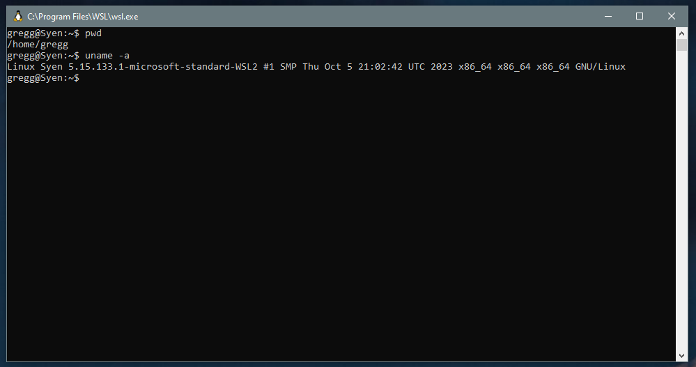
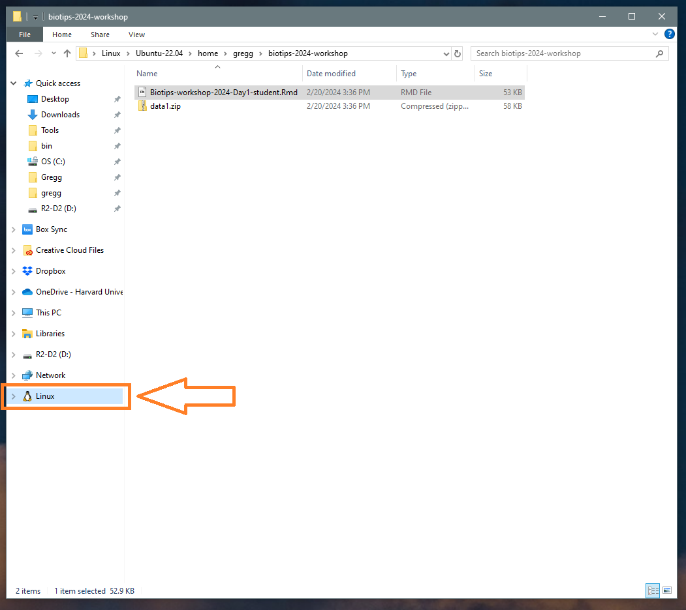

<style>
    table thead { display: none; }
    .md-typeset table, 
    .md-typeset th, 
    .md-typeset td {
        border: none !important;
    }
    /* Remove borders from table, th, and td */

    .md-typeset__table tr:nth-child(even):hover,
    .md-typeset__table tbody tr:nth-child(even):hover {
        background-color: #f6f8fa !important;
    }
    .md-typeset__table tr:nth-child(odd):hover,
    .md-typeset__table tbody tr:nth-child(odd):hover {
        background-color: #ffffff !important;
    }
    /* Disable hover effect on table rows */

    .md-button {
        text-align: center !important;
        justify-content: center !important;
        align-items: center !important;
        display: inline-flex !important;
    }
    /* Center the text in the button */
    
</style>

These are instructions for those who cannot request a FASRC account and access the Cannon cluster! Data will be downloaded locally and you will need to install software on your computer to follow along with the workshop. Please confirm you have followed the instructions on this page BEFORE class by replying to the e-mail you received about the workshop. We will unfortunately be UNABLE to help you with these steps during class.

 If you have or can request a FASRC account, we **highly recommend** you do so and follow the [Cannon setup instructions](setup-cannon.md).

 ## Before Class

 There are several things you'll need to do BEFORE class. For those of us without a FASRC account, we'll be installing some software locally on our computers and downloading the workshop data. 

!!! warning "Perform this setup BEFORE class!"

    Please confirm you have followed the instructions on this page BEFORE class by replying to the e-mail you received about the workshop. You may come to our [office hours or arrange to meet with us individually](https://informatics.fas.harvard.edu/contact/) for help, but we will unfortunately be UNABLE to help you with these steps during class. 

### 0. Installing WSL

For Windows users, you'll need to install a Linux distribution within your Windows operating system. Don't worry! This is easy now with the Windows Subsystem for Linux (WSL). Follow the link below for instructions on how to install WSL: 

[How to: Install WSL :octicons-link-external-24:](https://docs.microsoft.com/en-us/windows/wsl/install){ .md-button .md-button--primary .centered }

This may take some time, and your computer may restart a few times. Once WSL is installed, you'll have a Linux terminal available to you in Windows. You can open this terminal by typing "wsl" in the search bar and clicking the app that appears: 



Also, once you have WSL installed, your Linux distribution will appear in your Windows file system as a mounted drive in the file explorer: 



### 1. Installing [mamba](https://mamba.io/docs/getting_started.html)

Mamba is a package manager that allows us to easily install other software. You'll need to install mamba to install the other software you'll need for the workshop. Follow the instructions below to install mamba.

!!! important "Run commands in your terminal"

    All commands should be run in your terminal: WSL for Windows, Terminal for Mac. 

#### Mac users

For Macs, we're going to install mamba via homebrew, another package manager specific to MacOS. If you already have homebrew installed (i.e. you can type the command brew in your Terminal and don't get a "command not found" error), you can skip this step. If not, use the following command to install homebrew: 

```bash
/bin/bash -c "$(curl -fsSL https://raw.githubusercontent.com/Homebrew/install/HEAD/install.sh)"
```

Now, you should be able to type `brew` in your Terminal and not get an error. If you do still get an error, try restarting your Terminal and trying again.

Once you have homebrew installed, you can install mamba with the following command: 

```bash
brew install miniforge
```

And then initialize mamba with the following command: 

```bash
conda init zsh
```

#### Windows users

For Windows, you'll need to install mamba (aka miniforge) via your new Linux terminal (WSL). Open the terminal and follow the instructions at the link below to install mamba: 

[How to: Install mamba :octicons-link-external-24:](https://github.com/conda-forge/miniforge?tab=readme-ov-file#unix-like-platforms-macos-linux--wsl){ .md-button .md-button--primary .centered }

Follow the on-screen prompts to complete installation. Restart your terminal and you should be able to use mamba. 

---

### 2. Creating a workshop directory

It will be helpful for you to have a dedicated directory on your computer for the workshop. You can download the data and file for each day into this directory. You can create the directory manually through your OS's gui, or in your terminal (WSL for Windows, Terminal for Mac) with the following command: 

```bash
mkdir ~/biotips-workshop-2024/
```

Then, navigate into the directory with: 

```bash
cd ~/biotips-workshop-2024/
```

Note that this will create a directory called "biotips-2024-workshop" in your current working directory. If you want the directory somewhere else, you can specify the path or navigate to the desired location before running the `mkdir` command. 

---

### 3. Loading the workshop environment

Once you have mamba installed, you can load the workshop environment. We've created an environment file that contains all the software you'll need for the workshop. You can download this file from the link below: 

[Download the environment file by clicking here](https://harvardinformatics.github.io/workshops/2024-spring/biotips/env.yml) or by running the following command in your terminal: 

```bash
wget https://harvardinformatics.github.io/workshops/2024-spring/biotips/env.yml
```

Once you have the file, you can create the environment with the following command: 

```bash
mamba env create -f env.yml
```

!!! important "Newer Macs need a slightly different command"

    Newer Macs (OSX ARM64) need an additional parameter to correctly install the environment. If you have a newer Mac, use the following command instead: 

    ```bash
    mamba env create -f env.yml --platform osx-64
    ```

This will create a new environment called "biotips" on your computer. You can activate this environment with the following command: 

```bash
mamba activate biotips
```

With the environment installed and activated, you should be able to access the software needed for the workshop. You can test this out by typing some of the following commands: 

```bash
bcftools --version
samtools
bedtools
```

If any of these give you an error, you'll have to figure out what went wrong. Otherwise, you can download the data for each day below. 

---

### 4. Downloading the workshop data

Each day, you will need to download two things: (1) The workshop data (.zip files) and (2) the workshop file (.Rmd files). The links to these files will become available as the date of the workshop approaches. 

#### Workshop data (.zip files)

Use the following links to download the data for each day.

##### Day 1 data download

[Download the Day 1 workshop file by clicking here](https://harvardinformatics.github.io/workshops/2024-spring/biotips/data1.zip) or run the following command in your terminal: 

```bash
wget https://harvardinformatics.github.io/workshops/2024-spring/biotips/data1.zip
```

##### Day 2 data download

[Download the Day 2 workshop file by clicking here](https://harvardinformatics.github.io/workshops/2024-spring/biotips/data2.zip) or run the following command in your terminal: 

```bash
wget https://harvardinformatics.github.io/workshops/2024-spring/biotips/data2.zip
```

##### Day 3 data download

[Download the Day 3 workshop file by clicking here](https://harvardinformatics.github.io/workshops/2024-spring/biotips/data3.zip) or run the following command in your terminal: 

```bash
wget https://harvardinformatics.github.io/workshops/2024-spring/biotips/data3.zip
```

##### Day 4 data download
[Download the Day 4 workshop file by clicking here](https://harvardinformatics.github.io/workshops/2024-spring/biotips/data4.zip) or run the following command in your terminal: 

```bash
wget https://harvardinformatics.github.io/workshops/2024-spring/biotips/data4.zip
```

Once you have the .zip file downloaded and placed in your workshop directory (see box above), you'll want to open your terminal program (WSL for Windows, Terminal for Mac) and navigate to the directory where you downloaded the file. Then, you can extract the contents with the `unzip` command, e.g.: 

```bash
unzip data1.zip
```

#### Workshop files (.Rmd files)

Use the following links to download the workshop file for each day.

##### Day 1 workshop file

[Download the Day 1 workshop file by clicking here](https://harvardinformatics.github.io/workshops/2024-spring/biotips/Biotips-workshop-2024-Day1-student.Rmd) or run the following command in your terminal: 

```bash
wget https://harvardinformatics.github.io/workshops/2024-spring/biotips/Biotips-workshop-2024-Day1-student.Rmd
```

##### Day 2 workshop file

[Download the Day 2 workshop file by clicking here](https://harvardinformatics.github.io/workshops/2024-spring/biotips/Biotips-workshop-2024-Day2-student.Rmd) or run the following command in your terminal: 

```bash
wget https://harvardinformatics.github.io/workshops/2024-spring/biotips/Biotips-workshop-2024-Day2-student.Rmd
```

##### Day 3 workshop file

[Download the Day 3 workshop file by clicking here](https://harvardinformatics.github.io/workshops/2024-spring/biotips/Biotips-workshop-2024-Day3-student.Rmd) or run the following command in your terminal: 

```bash
wget https://harvardinformatics.github.io/workshops/2024-spring/biotips/Biotips-workshop-2024-Day3-student.Rmd
```

##### Day 4 workshop file
[Download the Day 4 workshop file by clicking here](https://harvardinformatics.github.io/workshops/2024-spring/biotips/Biotips-workshop-2024-Day4-student.Rmd) or run the following command in your terminal: 

```bash
wget https://harvardinformatics.github.io/workshops/2024-spring/biotips/Biotips-workshop-2024-Day4-student.Rmd
```

!!! important "Make sure the .Rmd files are in your workshop directory"

    Make sure you download the .Rmd files into the `biotips-workshop-2024` directory you created earlier. You can check this by running the command `ls` in your terminal, which will list the files in your current working directory. You should see the .Rmd files listed there.

---

### 5. Opening the workshop file

We have implemented the workshop as an Rmarkdown file. This is a file that contains both text and code. While this has several advantages for us, it is ultimately a plain text file and should be somewhat readable in any text editor.

Please open this file in any text editor you like and take a look at the contents and follow along with the workshop. For those with R and Rstudio installed, you can also open it in RStudio, which is a program specifically designed for working with Rmarkdown files.

---

### 6. Rendered workshop files

We also provide the rendered .html files for each day, complete with solutions to exercises:

|     |     |     |     |
| --- | --- | --- | --- |
| [Day 1 - Genomics formats & tools, part 1 :material-arrow-right:](https://harvardinformatics.github.io/workshops/2024-spring/biotips/Biotips-workshop-2024-Day1-instructor.html){ .md-button } | [Day 2 - Genomics formats & tools, part 2 :material-arrow-right:](https://harvardinformatics.github.io/workshops/2024-spring/biotips/Biotips-workshop-2024-Day2-instructor.html){ .md-button } | [Day 3 - Shell scripting, part 1 :material-arrow-right:](https://harvardinformatics.github.io/workshops/2024-spring/biotips/Biotips-workshop-2024-Day3-instructor.html){ .md-button } | [Day 4 - Shell scripting, part 2 :material-arrow-right:](https://harvardinformatics.github.io/workshops/2024-spring/biotips/Biotips-workshop-2024-Day4-instructor.html){ .md-button } |